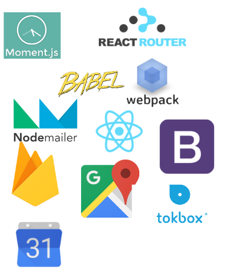

# JamSesh

> For people who play instruments and are looking to jam.

## Team

  - __Product Owner__: Chris Dakin
  - __Scrum Master__: Marina Cerame
  - __Development Team Members__: Chris Dakin, Marina Cerame

## Legacy Team

  - __Product Owner__: Jacques Metevier
  - __Scrum Master__: Marina McGrath
  - __Development Team Members__: Jacques Metevier, Marina McGrath

## Table of Contents

1. [Usage](#Usage)
1. [Requirements](#requirements)
1. [Installing Dependencies](#installing-dependencies)
1. [How it Works] (#how-it-works)
1. [Team](#team)
1. [Contributing](#contributing)
1. [Pictures](#pictures)
## Usage

1. NPM Install
2. NPM Start to run locally
3. NPM Run deploy to deploy once firebase account is setup

## Requirements

Node ^8.1.0

## Tech Stack

### Installing Dependencies

From within the root directory:

npm install

## How It Works

A band member can create a profile and go to "Create Group" to make a posting. There they can include the details of who they're looking for. The location input will suggest nearby known addresses to ensure correct display of address. Once created, the posting will show up on the homepage on the map and with the details below.

### Live Jam

Once each user who wants to Live Jam has an account, simply go to Live Jam and click the name of the other user to open live video chat where you can jam together.

### Messages
When messaging using Inbox, the other user will receive an email notification of the new message.

## Contributing

See [CONTRIBUTING.md](CONTRIBUTING.md) for contribution guidelines.

## Pictures

